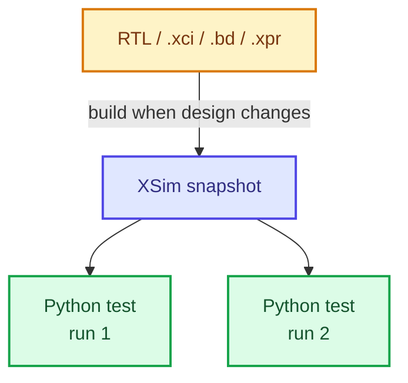

# cocotb-vivado

[](https://pypi.org/project/cocotb-vivado/)
[](https://github.com/themperek/cocotb-vivado/actions/workflows/lint.yml)

Test Vivado designs from Python with [cocotb](https://github.com/cocotb/cocotb/) and XSim.

`cocotb-vivado` works with plain RTL, Vivado IP (`.xci`), block designs (`.bd`) and complete
projects (`.xpr`).

If your design already depends on Vivado, you can keep XSim and write the testbench in Python instead of VHDL or SystemVerilog.

## Why cocotb-vivado?

- Test designs that contain Xilinx IP and Vivado block designs.
- Use cocotb, pytest and Python libraries in the testbench.
- Keep XSim. No Questa, VCS or Xcelium setup is required.
- Change Python tests and rerun them without recompiling the HDL.
- Use cocotb extensions such as [cocotbext-axi](https://github.com/alexforencich/cocotbext-axi) with AXI/AXIS interfaces.


**A typical workflow is:**




## Build once, rerun tests

Changing a Python test does not require recompiling or re-elaborating the HDL.

`runner.build()` uses a content-hash cache. If the HDL, Vivado sources,
build options and relevant tool versions have not changed, the existing
XSim snapshot is reused.

Pass `always=True` to force a rebuild.

## Installation

```bash
pip install cocotb-vivado
```

Set up the Vivado environment before running:

```bash
source /path/to/Vivado/<version>/settings64.sh
```

`xelab`, `xvlog` and `xvhdl` must be on `PATH`. `LD_LIBRARY_PATH` must also be
set, or `XILINX_VIVADO` can be used as a fallback so the runner can construct
the required library path for the test subprocess.

## Quickstart

```python
from pathlib import Path

import cocotb
from cocotb.triggers import Timer

from cocotb_vivado.runner import get_runner


@cocotb.test()
async def simple_test(dut):
    dut.clk.value = 0
    await Timer(10, unit="ns")
    dut.clk.value = 1
    await Timer(10, unit="ns")
    assert dut.out.value == 1


def test_simple():
    runner = get_runner("vivado")

    # Compile and elaborate only when the design or build options change.
    runner.build(
        sources=[Path(__file__).parent / "tb.v"],
        hdl_toplevel="tb",
        timescale=("1ns", "1ps"),
    )

    runner.test(
        hdl_toplevel="tb",
        test_module="test_simple",
        hdl_toplevel_lang="verilog",
        testcase="simple_test",
    )
```

Run it with pytest:

```bash
pytest -s test_simple.py
```

Now change only `simple_test()` and run it again. The HDL build is reused.

See [`examples/`](examples/) for runnable projects and `tests/` for more
scenarios.

## Where it fits

`cocotb-vivado` is mainly intended for designs where XSim is already part of
the flow because of Vivado-specific content. Typical cases include an existing
`.xpr` project, generated Xilinx IP, a block design, mixed-language simulation,
or an AXI/AXIS design that you want to drive with `cocotbext-axi`.

For portable RTL, another cocotb-supported simulator may be simpler or faster.
The point of this project is to use cocotb when the simulation target needs
Vivado/XSim.

## Vivado-managed sources (IP / BD / XPR)

Vivado inputs are passed to the runner as source objects from
`cocotb_vivado.vivado`, alongside plain HDL paths in
`runner.build(sources=[...])`. Choose the class that matches the input format:

| Input | Class | Vivado mechanism |
|-------|-------|------------------|
| `.xci` | `VivadoIp` | `add_files; export_ip_user_files` |
| `.bd` | `VivadoBd` | `make_wrapper; launch_simulation -scripts_only` |
| `.xpr` | `VivadoProject` | `open_project; launch_simulation -scripts_only` |
| `.tcl` / pre-extracted | `VivadoExportedSim` | runs your TCL |

A source object goes in the same `sources=` list as plain HDL. In this example,
a `blk_mem_gen` IP is instantiated by a hand-written wrapper, and the wrapper
is the toplevel (`tests/test_bram.py`):

```python
from pathlib import Path

from cocotb_vivado.runner import get_runner
from cocotb_vivado.vivado import VivadoIp

here = Path(__file__).resolve().parent
runner = get_runner("vivado")
runner.build(
    sources=[
        VivadoIp(
            "ip/blk_mem_kilobyte/blk_mem_kilobyte.xci",
            builder_tcl=here / "ip" / "blk_mem_kilobyte" / "regen.tcl",
            part_num="xczu7eg-ffvc1156-2-e",
        ),
        here / "bram_wrap.sv",
    ],
    hdl_toplevel="bram_wrap",
)
```

A block design or project defines its own toplevel and reports the names to use
(`tests/test_bd_axi.py`):

```python
from cocotb_vivado.vivado import VivadoBd

bd = VivadoBd(
    "ip/bd_axi/bd_axi.bd",
    builder_tcl=here / "ip" / "bd_axi" / "regen.tcl",
    part_num="xczu7eg-ffvc1156-2-e",
)
runner.build(
    sources=[bd],
    hdl_toplevel=bd.top,        # "bd_axi_wrapper", Vivado's wrapper name
    hdl_library=bd.library,     # "xil_defaultlib"
)
```

Relative `.xci` and `.bd` paths resolve under the build directory, because that
is where `builder_tcl` deposits them. `builder_tcl` itself is an input you
already have, so pass it as an absolute path. A relative `builder_tcl` path
resolves against the current working directory.

Use one design-defining source per build. `hdl_library` is a single setting for
the whole build, so every plain source is compiled into that library and the
toplevel is elaborated from it. `VivadoBd`, `VivadoProject` and
`VivadoExportedSim` each extract into `xil_defaultlib`. Combining two of them in
one build merges independently generated structural HDL sets and can cause name
collisions. Use at most one of those three, plus any number of `VivadoIp` and
plain HDL sources.

Each Vivado source runs the required Vivado batch command, with mtime-based
caching, and returns a parsed view of the generated `xsim/` directory. The
runner uses the per-language `.prj` files with `xvlog -prj` / `xvhdl -prj` and
reads the sibling `*.sh` script to recover the `xelab` library arguments and
any `<lib>.glbl` modules. `VivadoBd`, `VivadoProject` and `VivadoExportedSim`
use `launch_simulation -scripts_only -absolute_path`; `VivadoIp` uses
`export_ip_user_files`.

### Block designs and interface flattening

XSI exposes only top-level scalar ports. It does not provide hierarchical or
interface access. A block design whose top uses `create_bd_intf_port`
(AXI/AXIS/BRAM) therefore cannot be driven directly.

`VivadoBd` uses `wrapper=True` by default and asks Vivado to generate an RTL
wrapper with `make_wrapper -top`. The wrapper flattens interface bundles into
scalar ports, which is the form expected by `cocotbext-axi`. `bd.top` reports
the resulting `<bd>_wrapper` name, so it does not have to be hardcoded.

If a block design uses only plain signals created with `create_bd_port`, pass
`wrapper=False` to elaborate the BD module directly. In that case `bd.top` is
the bare `<bd>` name.

`part_num` is required for `VivadoIp` and `VivadoBd` because the generator needs
a `set_part` target. `VivadoProject` reads the part from the XPR and accepts an
optional `part_num` to retarget the project in memory for simulation.
`VivadoExportedSim` leaves part selection to its TCL script.

If `part_num` is not supplied, the code can fall back to the
`COCOTB_DEFAULT_PART_NUM` environment variable.
`cocotb_vivado.vivado.discover_default_part()` is an opt-in helper that queries
Vivado once and caches the result. Pure RTL builds without a `VivadoSource`
object do not invoke the `vivado` binary.

A `.bd` file can be committed with the test or regenerated on the first build
with `builder_tcl`. A builder script constructs the design and calls
`save_bd_design`, which can make the test fixture less dependent on a checked-in
Vivado-generated file.

To use a block design below your own RTL toplevel, list the `VivadoBd` together
with the HDL and name your module as the top:

```python
sources=[VivadoBd("x.bd"), "my_tb.sv"]
hdl_toplevel="my_tb"
```

See `tests/test_bd_axi.py` for a `VivadoBd` example that flattens an AXI-Lite +
AXIS block design. `tests/test_fw.py` shows the equivalent setup with a full
`VivadoProject`.

## cocotb extensions

Extensions such as
[cocotbext-axi](https://github.com/alexforencich/cocotbext-axi) work when the DUT
is clocked by a Python-driven `Clock`. XSI does not expose a native GPI clock.
AXI bus accesses still go through the cocotb scheduler expected by the
extension.

## Waveform output

The `wave_format` argument on `runner.build()` / `runner.test()` selects the
output format:

```python
runner.build(..., wave_format="vcd")      # Verilog $dumpfile/$dumpvars
runner.build(..., wave_format="fst")      # VCD post-processed by vcd2fst
runner.build(..., wave_format="wdb")      # Vivado native, viewable in xsim --gui
runner.build(...)                         # default: no waves
```

All formats are written to `{build_dir}/{hdl_toplevel}.{ext}`.

## Project status and limitations

The project is under active development, and the Python runner API is still
changing. See [CHANGELOG.md](CHANGELOG.md) for recent changes and
[MIGRATION.md](MIGRATION.md) for breaking changes.

Current XSI limitations:

- XSI exposes only top-level ports.
- `RisingEdge` / `FallingEdge` / `Edge` see changes only after Python advances
  simulation time with `Timer` or `cocotb.clock.Clock`. Verilog `#` delays are
  not visible to those triggers. Waiting on an edge from a DUT-driven clock
  without concurrent Python-driven time advance will therefore not progress.
- `$dumpfile` / `$dumpvars` waveform dumping is Verilog-only and cannot attach
  to a VHDL top. For VHDL tops, use Vivado WDB output with
  `wave_format="wdb"`.
- `cocotb_vivado.xsi` provides direct access to the XSI interface for low-level
  tooling.

### Platform support

The current loader supports Linux only. `cocotb-vivado` loads the XSim snapshot
(`xsimk.so`) with `ctypes` and derives `LD_LIBRARY_PATH` from Vivado's
`lib/lnx64.o`.

XSI itself is available on Windows as well, but the Windows path has not been
tested here.

### Tested Vivado versions

- Vivado **2023.1** is the minimum supported version.
- Newer versions are expected to work but should be verified locally.

## Implementation notes: GPI shim

XSim exposes no VPI/VHPI, so the runner replaces `cocotb.simulator` with an
in-process XSI stub. cocotb binds that handle when it is imported, so the stub
has to be installed first: the `python -m cocotb_vivado` subprocess that
`runner.test()` starts installs it before importing cocotb, then loads your
test module.

Importing `cocotb_vivado` itself has no side effects, so your testbench can
import `cocotb` and `cocotb_vivado` in either order:

```python
import cocotb
from cocotb.clock import Clock
from cocotb.triggers import RisingEdge, Timer

from cocotb_vivado.runner import get_runner
```

## Contributing

See [CONTRIBUTING.md](CONTRIBUTING.md).

## Acknowledgments

Based on [cocotb-stub-sim](https://github.com/fvutils/cocotb-stub-sim).

The Python runner and value-change manager are derived from
[vicoco](https://github.com/kiran-vuksanaj/vicoco) by Kiran Vuksanaj.

Thanks to [Dectris](https://dectris.com/) for supporting this work.
